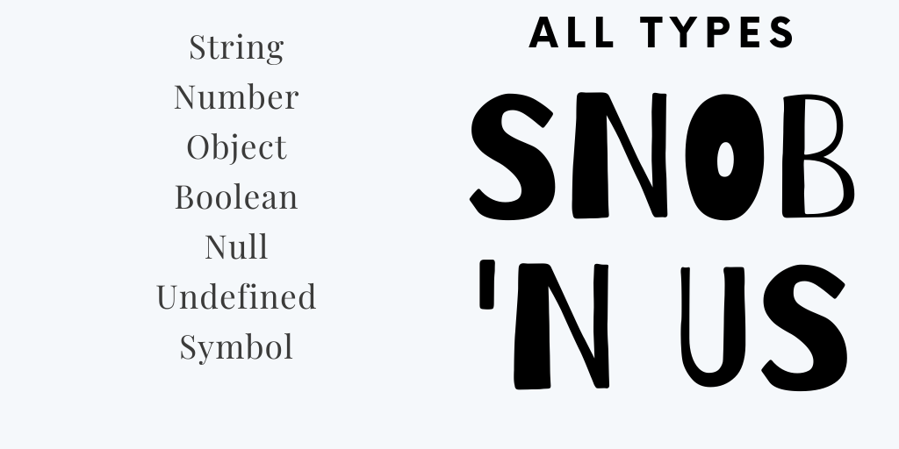
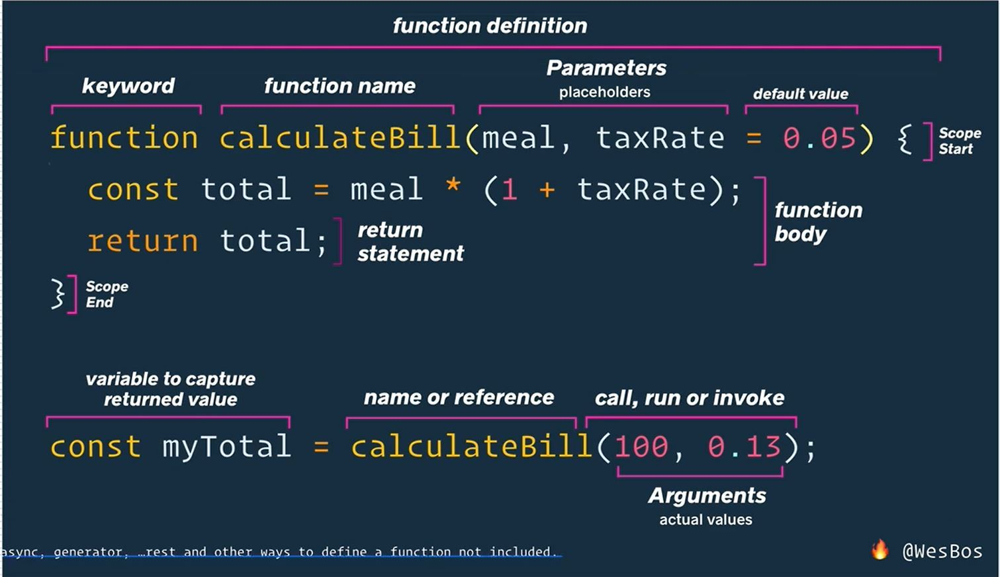

# 100 Days of Wes Bos


This is [Wes Bos][11]. He's a great teacher and programmer. He also has a podcast for Web Developers (with Scott Tolinksi) called [Syntax.fm][9]. He's on twitter [@wesbos][12].

I have bought a few of his courses but never finished them so I am starting, today, March 31, 2020, a concerted effort to finish what I started (and bought!) with **#100DaysOfWesBos** a cheeky offshoot of [**#100DaysOfCode**][13] which I have done twice. (I started #365DaysOfCode once, but it was too much of a commitment.)

---

## Courses on My List
- [x] [Mastering Markdown][1]
- [ ] [Learn Node][2]
- [ ] [JavaScript 30 (free)][2]
- [ ] [React for Beginners][4]
- [ ] [ES6 for Everyone][5]
- [ ] [CSSGrid.io (free, thanks to Mozilla)][6]
- [x] [Flexbox.io (free)][7]
- [x] [Command Line Power User (free)][8]
- [ ] [Beginner JavaScript][104]

## Plan (order of operations)
1. Mastering Markdown
2. Command Line Power User
3. Flexbox.io
4. CSS Grid
5. Beginner JavaScript (added)
5. ES6 for Everyone
6. JavaScript 30
7. React for Beginners
8. Learn Node

---

### A side note

As of today, March 31, 2020,  [Wes Bos][11] is having a 50% off sale on all of his courses, so if you are stuck at home with some time on your hands during the [Covid-19 Quarantine days][10], now is a good time to upskill and learn some code at a discounted price. He lists the sale on the banner on top of all the course pages (unless they are free--free is still free!)

---
# 100 Days of Wes Bos

### Day 1 - 03.31.2020
Started and finished [**Mastering Markdown**][1]. I know and love Markdown but I would like to fill in any gaps before I get started with everything else. Able to finish it during my lunch hour and bang out _**this**_ document.

### Day 2 - 04.01.2020
Plan: [**Command Line Power User**][8]. Looking forward to _"Getting the Most Out of ZSH with Plugins"_. While I use Oh My Zsh, I didn't know there were plugins for ZSH. This one is about 75 minutes long so one lunch hour won't do it.

Actual: Went through 6/11 of the videos of [**Command Line Power User**][8]. Didn't get to my favorite part yet, but that just means something to look forward to. Discovered [iTerm2 themes][17], [ZSH themes][16] and [Powerline fonts][15]. Git is more fun when it's color-coded and readable.

### Day 3 - 04.02.2020
Plan: Finish [**Command Line Power User**][8].

Actual: I did finish [**Command Line Power User**][8]. Learned so many tips and tricks that are possible with ZSH. Like ```take``` instead of separate ```mkdir``` and ```cd``` commandds. Like advanced history commands with one word and tab or control r. Really neat. The trick is to use them so I don't forget them.

[ZSH plugins][18] extend the functionality and features of ZSH. So the ones I tried:
- node
- npm
- common-aliases
- extract
- git-prompt
- github

The [z][19] is not working so hot for me right now, so I will leave that for now.

Learned the reasons to use ```trash``` instead of ```rm```. Only possible if you use ZSH instead of bash, I believe. Installable by npm with this command line: ```npm install --global trash-cli```. Literally **awesome**. Find [trash on npm][21]

Then add ```alias rm=trash``` to your .zshrc to reduce typing & safely trash

Found this list of [awesome ZSH frameworks, plugins, themes and tutorials][20].

Also _forgot to eat my lunch and had to eat at my desk after lunch_. Oops.

### Day 4 - 04.03.2020
**Plan:** Start Flexbox.io. Should be able to get through 4/20 videos.

### Day 4 - 04.04.2020
Attended [Remote Control Summit][23] Day 1.

Completed 4/20 videos from [Flexbox.io][7]

(Couldn't do yesterday as I skipped lunch hour to make up for the time missed for my a.m. doctor appointment. Our boss bought the office at lunch and I ate at my desk and worked through lunch. (Thanks boss!) No free time at home.)

- [Github page about What The Flexbox][22]

### 04.05.2020

Attended [Remote Control Summit][23] Day 2.

### Day 5 - 04.07.2020

Completed section on alignment (videos 6, 7, 8, and 9). Aligning with ```justify-content```, ```align-items```, ```align-self```, and ```align-content```. More clarity on main axis and cross-axis.

Referred us to this great resource: [CSS Tricks Explainer][24].

And, I found this one: [Article from WPMUDev about Flexbox in WordPress][25] .

### Day 6 - 04.08.2020
Completed videos 10, 11, 12, and 13 about ```flex``` property with  ```flex-grow```, ```flex-shrink```, ```flex-basis``` and wrapping along with cross-browser support and using autoprefixers to fill in gaps in browser support.

### Day 7 - 04.09.2020
Completed [Flexbox.io][7] videos 14 and 15 about  making navigation menus and handling mobile re-ordering with flexbox.

### Day 8 - 04.11.2020
Completeted 4 sections of Javascript curriculum that [LaunchCode][27] is planning to use for their next cohort in my area. Did a [Focusmate][26] session for the first time. It's an accountability buddy app and it did keep me planted in my chair for the entire 50 minutes so I guess you could say it worked. I did not wander the internet for other topics either because I told my buddy for the day, James, _I was intending to get through 4 or 5 sections_ and I didn't want to tell him I didn't at the end. So I did get through to section 4.4 during the session and continued after it was done.

[Exercise completed for section 4.8][28]

[Studio completed for section 4.9][29]

Continuing with [Flexbox.io][7] with videos 16 and 17. Nested Flexbox really blew my mind. I don't remember them mentioninig this in [freecodecamp][32].

### Day 9 - 04.14.2020

Finished [Flexbox.io][7] tonight:

- Video #18: Equal height columns and leftover elements
- Video #19: Flexbox single line form (more nested Flexbox!)
- Video #20: Create a mobile app layout with Flexbox (more nested Flexbox --seeing a theme!)

The last video also mentions and shows us [how Flexbox is used in React Active][37]. Pretty cool and I will keep that in my back pocket for later.

It just works! (Really!)

Two cool websites Wes Bos has showed us:

 - [lorempixel][33] random image generator for your website in the size you specify. basically a lorem ipsum for photos instead of text. i found a few other [placeholder image][34] sites while i was looking including [lorem picsum][36] (so clever!).
 - [coverr][34] same thing but with video and not random. you pick them. free stock video footage.  try it out. they've even got a great selection of Zoom virtual backgrounds for these trying times.

 _The best thing to come out of this: I am finally understanding what that [monster Flexbox post on CSSTricks][24] is all about._ Show *and* tell.

The learning part[Section 5][31] of the Launchcode [Javascript curriculum][30]: Making Decisions with Conditionals which goes from 5.1.1 to 5.5.1. Tonight I completed right before bed.

### Day 10 - 04.15.2020

**Plan:**

- Start [CSS Grid][6] at lunch
- The working part (exercies and studio so 5.6 and 5.7) of  [Section 5][31] of the Launchcode [Javascript curriculum][30]: Making Decisions with Conditionals
	- [Exercises in 5.6][38] with conditionals
		- add link to repl.it link for exercieses 1 and 2
		- add link to repl.it for exercises 3 and 4
	- [Studio in 5.7][39] about goal setting and having the right mindset.
- Attend Zoom meetup about the [LaunchCode][27] beta [JavaScript Curriculum][30] after work before my little one gets home from Daddy's house.

**Actual:**

- Started [CSS Grid][6] at lunch. Videos 1-3. Setting up NPM, browser-sync, making sure I have emmet to make life easier, making sure I'm using FIrefox Developer browser for all the CSS Grid Dev Tools goodies. Then a little bit of CSS Grid Funadamentals. Using the #GriddyUp hastag to find other who have done/are doing this course. And there are a few, even now. (This course was made years ago.)
	- 1. Welcome
	- 2. Starter FIles and Tooling Setup
	- 3. CSS Grid Fundamentals

- Read a [post on twitter][40] about suggested order of learning for front-end developers. I was flummoxed to see he put CSS Grid before Flexbox and kept reading down the thread to see that I wasn't alone. You won't understand CSS Grid if you haven't done Flexbox first. This is borne out in the videos when Wes mentions Flexbox and links what you did in Flexbox to how you do it in CSS Grid. Baby steps. (Good post on the [difference between FlexBox and CSSGrid][43]. One big sad difference pointed out by [Hashim Warren][44]: "The main difference for me is Flexbox works everywhere and Grid doesn’t."
- Also [Emmet is the jam][41]! Here's a nice writeup on [8 Emmet Tips You Might Now Know][42].
- Checked out [CSS Grid Generator][45] built by [Sarah Edo][46]. Better to use after learning so I don't shortchange myself on the knowledge. Awesome tool. Another one, [LayoutIt][47] works a little differently.
- Attended Zoom meetup about the [LaunchCode][27] beta [JavaScript Curriculum][30] after work

### Day 11 - 04.16.2020

Developer tools in Firefox for CSS Grid are incredible. I never knew the depth of this. Almost magical.
- [CSS Grid Inspector:Examine grid layouts][48]
- [Jen Simmons' Variations on a Grid][49] is a good place to try out Firefox Dev tools on a grid in the wild.
- Saved for later: [Jen Simmons' Layout Lab][50].

[CSSGRid.io][6] videos today:

- 4. CSS Grid Dev Tools (in [Firefox Developer Edition browser][51])
- 5. CSS Grid Implicit and Explicit Tracks (what they are and how to see them in Dev Tools)
- 6. CSS Grid Auto Flow Explained (CSS Grid's version of Flexbox's flex-direction property, sort of)

### Day 12 - 04.17.2020

[CSSGRid.io][6] videos today:

- 7. Sizing tracks in CSS Grid (fractional units of free space, as in ```grid-template-columns: 200px, 200px, 1fr 1fr;```, are better than percentages when working in CSS Grid so that margins don't mess up the proportions of your grid container)
- 8. CSS Grid Repeat Function as in ```grid-template-columns: repeat(4, 1fr);``` would give you four evenly spaced columns.
- 9. Sizing Grid Items (on a grid ```item``` not on a grid ```container```you can have one ```item``` span two columns as in  ```grid-column: span 2;```)

### Day 13 - 04.18.2020

I had a [FocusMate][26] session today which I thought very hard about cancelling becuse I really did not feel like getting out of bed and showering and whatnot. (Being on video with a stranger very much requires showering and whatnot.) Anyway, I did get up and shower and go to my Focusmate session and . . . he did not show up. So I was at my FocusMate session alone, which is fine. By which, I mean I stayed and kept working because what if he showed up and I wasn't there? Then I would be the bad guy. So even though my FocusMate was a no-show it stil fulfilled its purpose--getting me out of bed on a Saturday morning and helping me while I am working towards a goal.

[CSSGrdi.io][6] videos today:

- 10. Placing Grid Items
- 11. Spanning and Placing Cardio (a good practice session. I got most of them right. Missed 2.)
- 12. Auto-Fit and Auto-Fill
- 13. Using minmax() for Responsive Grids (Can replace media queries!)

Ended up in a blackhole of setting preferences in VS Code which led to perfescting zsh and git aliases. A waste of time that for some reason seems incredibly urgent at the time. Hopefully it will pay off later, _if I can remember my new aliases_. Luckily there is an alias for that will list all my aliases. Very meta.

Stayed at my desk a little bit longer to complete the [LaunchCode][27] JavaScript Conditionals [exercises for chapter 5][53].

My repl.its:

- [Conditional Exercises 1 & 2][52]
- [Conditional Exercises 3 & 4][53]
- [Conditional Exercises 5 & 6][55]

The studio for Chapter 5 is about "Goal Setting and Getting Into the Right Mindset"
They reference a [TED Talk by Carol Dweck][56] where she discusses the power of believing you can improve. There are two ways to think about a problem that’s slightly too hard for you to solve.
>Are you not smart enough to solve it … or have you just not solved it yet?

A valuable tidbit to keep in mind for myself and to remind my children of.

The chapter ends with some motivation and knowledge about the results of hard work: [Booster Rockets][58]
The gist of [LaunchCode's Best Practices for Learning to Code][57]:

* You learn to code by coding. Do your homework.
* Be ready for day one on the job. Do your homework.
* Use your mistakes as learning opportunities. Do your homework.
* Learning takes work, and you need the practice. Do your homework.
* Your heros worked really hard, so should you. Do your homework.
* Do your homework, and you will consistently get better.

In unrelated news, I also attended a couple of sessions from [WordCamp Santa Clarita][59]. I would have attended more but I forgot due to FocusMate debacle. (By the way my FocusMate sent me a note apologizing for not showing up. Very classy.)

### Day 14 - 04.20.2020
Read [Chapter 6][66] on Errors and Debugging in [LaunchCode][27] JavaScript course and completed Errors & Debgging [exercises for chapter 6][60].

My repl.its:

- [Debugging Exercise 1][61]
- [Debugging Exercise 2][62]
- [Debugging Exercise 3][63]
- [Debugging Exercise 4][64]
- [Debugging Exercise 5][65]

Videos in [CSSGrid.io][6]:

- 14. Grid Template Area (one thing I remember from [freecodecamp][67], I think.)
- 15. Naming Lines in CSS Grid

### Day 15 - 04.21.2020

Videos in [CSSGrid.io][6]:

- 16. Grid Auto Flow Dense Block Fitting 
- 17. CSS Grid Alignment and Centering

Read [Chapter 7][68] on "Stringing Characters Together" in [LaunchCode][27] JavaScript course.
 
### 04.22.2020

Not counting today  . . . because although I did code, I didn't do any Wes Bos. Wi-Fi was spotty at work and I couldn't do the videos on my lunch hour. 

Had to go shopping for my mom after ork because she is in self-quarantine. 

I did attend two hour class on [LuanchCode][27] JavaScript class. We talked about strings, arrays, functions and loops. 

### Day 16 - 04.23.2020

Videos in [CSSGrid.io][6]:

- 18. Re-ordering Grid Items (Caution: using ```order``` property can mess up your webpage's accessibility!)
- 19. Nesting Grid with Album Layouts

Having some trouble streaming the [CSS Grid][6] videos for some reason, so I switched to [ES6.io][5] to stay productive. 

Videos in [ES6.io][5]:

- 1. Getting Setup
- 2 - ```var``` Scoping Refresher (```var``` variable is function-scoped; ```let``` and ```const``` variables are block-scoped. Think of curly brackets as jail for these variables.)

Handy time to do this while I am going through the JavaScript overview sessions with [LaunchCode][27].

 
### Day 17 - 04.24.2020
 
In [CSSGrid.io][6], we made a **Grid Image Gallery**. Wes just out-of-nowhere added a bunch of ES6 JavaScript to randomly generate an image gallery and to add event listeners and I did not see that coming. So now my JS is leaking into my CSS Grid learning.

I [saw][69] an [interesting implementation of CSS Grid][70]. It does not look boxy like you would expect. 

In **let vs. const** video of [ES6.io][5] we learned about the difference between  ```let``` and ```const``` and when you would use each.

#### ES6 Notes:

- Cannot redeclare a ```let``` variable in the same scope. You can _update_ it, but you cannot _redeclare_ it.
- You could declare a ```let``` variable in window scope and again in function scope and those will be two _separate_ variables.
- ```const``` variables _cannot be updated_. ```const``` stands for _constant_.
- Properties of a ```const`` variable _can be_ updated.
- ```Object.freeze``` will make a ```const`` variable's properties unchangeable. 

Stayed home from work today with the youngest one to give the eldest one a day off as he was burnt out on 5-year-old shenanigans.

Have a FocusMate session tomorrow at 11:00 a.m. so I will be doing [LaunchCode][27] JavaScript work then. 

Then an exciting viewing of Disney's new-ish movie, Onward Bound.

### 04.25.2020
Focusmate session at 11:00 a.m. working on [LaunchCode][27] JavaScript.

**Chapter 7: "Stringing Characters Together"**

- [String Mad Lib repl.it][71]
- String Exercises 
	- [7.9.1][72]
	- [7.9.2.1][73]
	- [7.9.2.2][74] (Didn't do all of it.)
	 
**Chapter 8: Arrays Keep Things in Order**

- Read the chapter.
- Notes:
	- arrays are mutable, meaning that individual items in an array can be edited without a new array being created.
	- [W3Schools Array Reference][75]
	- [MDN Array Reference][76]
- Array Exercises:
	- [8.5.1][77]

That is all. No Wes Bos today so not counting today as a day.

### 04.26.2020
Day off

### Day 18 - 04.27.2020

[ES6.io][5] videos today:

[**```let``` and ```const``` in the real world:** ][83]

-	replacing the [IIFE][78] (initially invoke function expression). [Block Scope is the new IIFE][84]
- fix problem with ```for``` loops where variables in ```for``` leak out and become global variables. [Use ```let``` with ```for``` loops][85]
 
[**temporal dead zone:**][82]: 
 
 With ```let``` and ```const``` you cannot access a variable before it is defined. 
 
 With ```var``` you can acess the fact that a variable has created but not its value so accessing it will result in ```undefined``` rather than variable has not been defined error.

[**Is ```var``` dead? What should I use?:**][81]

How Wes goes about it by way of [this blog post by Mathis Bynens][79]:

1. use ```const``` by default
2. only use ```let``if rebinding is needed
3. (var shouldn't be used in ES6)

Another popoular opinion [via Kyle Simpson][80] of You Don't Know JS fame: 

1. use ```var``` for top-level variables that are shared across many (especially larger) scopes.
2. Use ```let``` for localized variables in smaller scopes.
3. Refactor ```let``` to ```const``` only after some code has been written and you're reasonably sure that you've got a case where there shouldn't be variable reassignment. 

So basically these two opinions are diametrically opposed. 

### Day 19 - 04.28.2020

ES6.io today:

**[Introduction to Arrow Functions][86]**

Three benefits:

1. more concise than regular functions
2. implicit return allows us to write one-liners
3. doesn't re-bind the value of ```this``` when you use an arrow function inside another function

**=>** is the "fat arrow" used in _arrow functions_

Example function that adds last names to all the first names in our array re-written as an _arrow function_:

declaring array of first names:

```const names = ['wes', 'kait', 'lux'];```


function written the 'regular' way:
```const fullnames = names.map(function(name) {return `${name} bos`;});```

function written as an arrow function:
```const fullnames2 = names.map((name) => {return `${name} bos`;});```

If you only have one parameter, as we do, you *can choose to* omit one set of parentheses:
```const fullnames3 = names.map(name => { return `${name} bos`;});```

example of implicit return (delete curly brackets and ```return``` keyword):
``` const fullnames4 = names.map(name => `${name} box`);```

```console.log(fullnames);``` returns ```['wes bos', 'kait bos', lux bos']```

More elegantly shown in my [arrow functions repl.it][87]. All four of these return the same thing.

Arrow functions are always _anonymous functions_.
Benefit of named functions is doing stack trace to find reason for errors.

You can put an arrow function _inside_ a variable and that will make it easier to stack trace. 

**[More Arrow Function Examples][88]**

[My repl.it with this example set][89]

### Day 20 - 04.29.2020

**[Arrow Functions and ```this```][90]**

- [Working Repl.it][91]
- [Wes' CodePen][92]

He does not want to use arrow function because he wants ```this``` to bind to the box, not the window. Arrow functions bind to the parent scope. 

>>when you use an arrow function, the value of ```this``` is not rebound inside of that function. It is just inherited form whatever the parent scope is.

But he does want an arrow function on the ```setTimeOut``` function because he wants ```this``` to bind to the first (event listener) function.

>>Because when you have an arrow function, it does not change the value of this. It inherits the value of this from the parent.

And

>>The big takeaway here is that we can use an arrow function for things inside of a normal function and it's going to inherit the value of this.

Also attended [LaunchCode][27] Javascript class. Working on Chapter [11][93] on Functions and [12][94] on Objects. We did [Assignment 1][95] together.

### Day 21 - 05-02.2020

In [ES6.io][5], [JavaScript Default Function Arguments][98]

Explored today:

- ByteSized React Conference Day 2 (day 1 was yesterday)
- [30 free resources for JavaScript Resources][96]
- [Syntax.fm podcast episode 162 on JavaScript Fundamentals][97]
- [Pluralsight Tech Skills Day 2020 Conference held on April 23, 2020][99] ([direct YouTube link][100])


### 05.11.2020

Been on an extended break. My mother came for an unplanned visit and I had no free time between my mom, the kids, my partner and my job. Was quite a full house and schedule. Now I am getting back into it. 

Learning about building websites with Hugo, as I read something that sparked an interest. Not counting this as part of #100DaysOfWesBos though it would technically be parto fo #100DaysOfCode. 

- [Learning Static Site Building with Hugo][102]
- [Static Gen: A List of Static Site Generators for JAM Stack Sites][103]
-	Installed Hugo via homebrew on terminal: 

	```brew install hugo```

Spent a couple hours playing with this and then deleted it. It was a nice diversion, but it's time to get back to my path. 

--
Found out this weekend that [LaunchCode][27] has ceased operations in South Florida, so those of us who have not been hired yet for an apprenticeship are no longer going to be connected to jobs. 
>>As we begin to imagine what a post-COVID world looks like, LaunchCode has made the difficult decision to suspend operations in our Florida locations, as economic conditions and hiring challenges created by the pandemic now prevent our sustainable operation in the region. 

>>This decision also means LaunchCode will no longer be soliciting new employer partnerships and can no longer commit to connecting you with job opportunities. We are deeply sorry we’re not able to play a more direct role in launching your career. 


. . . which makes you wonder about the landscape those of us left behind. At least my classmates who are working together in GrammerHub are making progress on real projects together so good for them for being smart and sticking with that. I got too overwhelmed to contine that along with work and family.

--

### Day 22 05.13.2020

Since LaunchCode South Florida is no more, decided to add Wes Bos' [Beginner JavaScript][104] to my curriculum and skootch it ahead of [ES6.io][5] because I am confused right now and realize I need more JavaScript basics first, even though I've done it befoe elsewhere. I have forgotten more than I know.

So today is [Beginner JavaScript][104] [Day 1][105]. Half price. 28 hours long. I will be here for a while.

[Tweet for today][106]

Some [great notes][107] by [Soumya (@geekysrm)][109] (also on [github][108])

In [Beginner Javascript][104] today: 

1. Welcome ([notes][110])
2. Browser, Editor and Terminal Setup ([notes][111])
3. Running and Loading JS ([notes][112])
4. Variables and Statements ([notes][113])
5. [ESLint][116] and [Prettier][117] Set Up ([No-Sweat™ Eslint and Prettier Setup by Wes Bos on github][114]) ([notes][115])

### Day 23 05.14.2020

In [Beginner Javascript][104] today: 

6. Types - Introductions ([notes][118])
7. Types - Strings ([notes][119])
8. Types - Numbers ([notes][120])
9. Types - Objects ([notes][121])
10. Types - Null and Undefined ([notes][122])
11. Types - Booleans and Equality ([notes][123]) 

I liked Wes Bos' mnemonic device and made a graphic of it with Canva.



### Day 24 05.15.2020

In [Beginner Javascript][104] today: 

12. Functions - Built-In ([notes][124])
13. Functions - Custom ([notes][125])

I've got a [Focusmate][26] session tomorrow so I am planning on doing 2 more videos on functions and one on debugging. After that instead of editing and expanding Soumya Ranjan Mohanty's notes, I will have to start writing my own from scratch.

Tomorrow's plan:

14. Functions - Parameters and Arguments
15. Different Ways to Declare Functions
16. Debugging Tools


### Day 25 - 05.16.2020

I had a [FocusMate][26] session at 11:30 a.m. with Faisal R. I got through the first lesson with him and then was on my own for the rest.  

In [Beginner Javascript][104] today: 

14. Functions - Parameters and Arguments (parameters are p for possible. arguments are a for actual) ([notes][126])

	###### Pieces of a Function Defined:

	
	
15. Different Ways to Declare Functions ([notes][127])
	- function keyword
	- anonymous function
	- arrow functions (which are anonymous functions)
	- IIFE: **i**mmediately **i**nvoked **f**unction **e**pressions
	- methods (functions that live inside an object)
	

Became patron of [FunFunFunction](https://www.twitch.tv/funfunfunction) on Patreon again after a long hiatus. Joined [FunFunFunction Discord](https://funfun.chat). Discovered [CodingGarden twitch stream](https://www.twitch.tv/codinggarden) as they were hosted on FunFunFunction twitch today. Fun to watch people build something collaboratively.

Saving **Debugging Tools** ([notes][128]) for another day. My ears are tired of headphones! And my brain is tired too. Time to brave the grocery store for weekly provisions in the age of Coronavirus Covid-19. Aldi FTW!


### Day 26 - 05.18.20

In [Beginner Javascript][104] today: 

16. Debugging Tools - **very** eye-opening foray into the debugging mindset and tools to surgically examine your code to see what it is doing and when it is doing it. ([notes][128])

### Day 27 - 05.19.20
In [Beginner Javascript][104] today: 

First half of **Scope**. We got to global variables, function scope and block scope. Here are my [notes][129] so far.


--
###### Note To Self 05.20.20

I came across this snippet from Wes Bos:

>>There is overlap between the two courses — there is no need to take the ES6 course after this one. If you have already taken ES6, you'll still learn plenty in Beginner JavaScript!

So I can actually skip [ES6.io][5] course if I go all the way through the [Beginner Javascript](https://beginnerjavascript.com/) course because it would be redundant.

--

Hi from [tonomoshia](https://twitter.com/tonomoshia).<br>(c) 2020 [Elizabeth Reiher](https://elizabethreiher.com)
<hr>

[1]: http://masteringmarkdown.com/
[2]: https://learnnode.com/
[3]: https://javascript30.com/
[4]: https://reactforbeginners.com/
[5]: https://es6.io/
[6]: https://cssgrid.io/
[7]: http://flexbox.io/
[8]: http://commandlinepoweruser.com/
[9]: https://syntax.fm/
[10]: https://tonomoshia.com/covid-19/
[11]: https://wesbos.com/
[12]: https://twitter.com/wesbos
[13]: https://www.100daysofcode.com/
[14]: bit.ly/100DaysOfWesBos
[15]: https://github.com/powerline/fonts
[16]: https://github.com/ohmyzsh/ohmyzsh/wiki/Themes
[17]: https://iterm2colorschemes.com/
[18]: https://github.com/ohmyzsh/ohmyzsh/wiki/Plugins
[19]: https://github.com/rupa/z/
[20]: https://github.com/unixorn/awesome-zsh-plugins
[21]: https://www.npmjs.com/package/trash-cli
[22]: https://herminiotorres.github.io/whattheflexbox/
[23]: https://remote-control-summit.heysummit.com/
[24]: https://css-tricks.com/snippets/css/a-guide-to-flexbox/
[25]: https://premium.wpmudev.org/blog/css-flexbox
[26]: https://www.focusmate.com/
[27]: https://www.launchcode.org/
[28]: https://repl.it/@tonomoshia1/Exercises-Data-and-Variables
[29]: https://repl.it/@tonomoshia1/Studio-Data-and-Variables
[30]: https://education.launchcode.org/intro-to-professional-web-dev/
[31]: https://education.launchcode.org/intro-to-professional-web-dev/chapters/booleans-and-conditionals/booleans.html
[32]: https://www.freecodecamp.org/learn/responsive-web-design/css-flexbox/
[33]: http://lorempixel.com
[34]: https://coverr.co
[35]: https://loremipsum.io/21-of-the-best-placeholder-image-generators/
[36]: https://picsum.photos
[37]: https://reactnative.dev/docs/flexbox.html#content
[38]: https://education.launchcode.org/intro-to-professional-web-dev/chapters/booleans-and-conditionals/exercises.html
[39]: https://education.launchcode.org/intro-to-professional-web-dev/chapters/booleans-and-conditionals/studio.html
[40]: https://twitter.com/js_tut/status/1236415196509470722
[41]: https://twitter.com/chrisoncode/status/1004403839145934849
[42]: https://scotch.io/bar-talk/8-emmet-tips-you-might-not-know
[43]: https://css-tricks.com/quick-whats-the-difference-between-flexbox-and-grid/
[44]: https://twitter.com/hashim_warren
[45]: https://cssgrid-generator.netlify.app/
[46]: https://twitter.com/sarah_edo
[47]: https://grid.layoutit.com/
[48]: https://developer.mozilla.org/en-US/docs/Tools/Page_Inspector/How_to/Examine_grid_layouts
[49]: https://labs.jensimmons.com/2017/01-003.html
[50]: https://labs.jensimmons.com/
[51]: https://www.mozilla.org/en-US/firefox/developer/
[52]: https://repl.it/@tonomoshia1/ConditionalsExercises01
[53]: https://repl.it/@launchcode/ConditionalsExercises02
[54]: https://education.launchcode.org/intro-to-professional-web-dev/chapters/booleans-and-conditionals/exercises.html
[55]: https://repl.it/@tonomoshia1/ConditionalsExercises03
[56]: https://www.ted.com/talks/carol_dweck_the_power_of_believing_that_you_can_improve
[57]: https://education.launchcode.org/intro-to-professional-web-dev/chapters/booster-rockets/bestpractices.html#best-practices
[58]: https://education.launchcode.org/intro-to-professional-web-dev/chapters/booster-rockets/index.html
[59]: https://2020.santaclarita.wordcamp.org
[60]: https://education.launchcode.org/intro-to-professional-web-dev/chapters/errors-and-debugging/exercises.html
[61]: https://repl.it/@tonomoshia1/Debug1stSyntaxError
[62]: https://repl.it/@tonomoshia1/DebugSyntaxErrors2
[63]: https://repl.it/@tonomoshia1/DebugRuntimeErrors1
[64]: https://repl.it/@tonomoshia1/DebugRuntimeErrors2
[65]: https://repl.it/@tonomoshia1/DebugLogicErrors5
[66]: https://education.launchcode.org/intro-to-professional-web-dev/chapters/errors-and-debugging/index.html
[67]: https://www.freecodecamp.org/learn/responsive-web-design/css-grid/
[68]: https://education.launchcode.org/intro-to-professional-web-dev/chapters/strings/index.html
[69]: https://twitter.com/tonomoshia/status/1253742873318735872
[70]:https://codepen.io/andybarefoot/pen/oNjxYYG
[71]: https://repl.it/@tonomoshia1/String-Mad-Lib
[72]: https://repl.it/@tonomoshia1/StringExercises02-1
[73]: https://repl.it/@tonomoshia1/StringExercises03
[74]: https://repl.it/@tonomoshia1/DNA-strings
[75]: https://www.w3schools.com/jsref/jsref_obj_array.asp
[76]: https://developer.mozilla.org/en-US/docs/Web/JavaScript/Reference/Global_Objects/Array
[77]: https://repl.it/@tonomoshia1/ArrayExercises01
[78]: http://benalman.com/news/2010/11/immediately-invoked-function-expression/
[79]: https://mathiasbynens.be/notes/es6-const
[80]: http://blog.getify.com/constantly-confusing-const/
[81]:https://wesbos.com/is-var-dead
[82]: https://wesbos.com/temporal-dead-zone/
[83]: https://wesbos.com/es6-block-scope-iife/
[84]: https://wesbos.com/es6-block-scope-iife/
[85]: https://wesbos.com/for-of-es6/
[86]: https://wesbos.com/arrow-functions/
[87]: https://repl.it/@tonomoshia1/ArrowFunctions
[88]: https://wesbos.com/arrow-function-examples
[89]: https://repl.it/@tonomoshia1/MoreArrowFunctions
[90]: https://wesbos.com/arrow-functions-this-javascript/
[91]: https://repl.it/@tonomoshia1/Arrow-Functions-and-this-ES6io
[92]: https://codepen.io/wesbos/pen/KgpNjJ/
[93]: https://education.launchcode.org/intro-to-professional-web-dev/chapters/more-on-functions/index.html
[94]: https://education.launchcode.org/intro-to-professional-web-dev/chapters/objects-and-math/index.html
[95]: https://education.launchcode.org/intro-to-professional-web-dev/assignments/candidateQuiz.html
[96]: https://madisonkanna.com/30-free-resources-javascript/
[97]: https://syntax.fm/show/162/the-fundamentals-js
[98]: https://wesbos.com/javascript-default-function-arguments/
[99]: https://www.pluralsight.com/techskillsday
[100]: https://youtu.be/rO0ol6Inncc
[101]: https://google.com
[102]: https://www.linkedin.com/learning-login/share?forceAccount=false&redirect=https%3A%2F%2Fwww.linkedin.com%2Flearning%2Flearning-static-site-building-with-hugo-2%3Ftrk%3Dshare_ent_url&account=35754684
[103]: https://www.staticgen.com/
[104]: https://beginnerjavascript.com/
[105]: https://twitter.com/tonomoshia/status/1260630015760269318
[106]: https://twitter.com/tonomoshia/status/1260632480400445440
[107]: https://www.notion.so/Beginner-JavaScript-e2ef045754d14e96b93791f638bbcaf6
[108]: https://github.com/geekysrm/javascript-notes
[109]: https://twitter.com/geekysrm
[110]: https://github.com/tonomoshia/javascript-notes/blob/master/01-chrome-shortcuts.md
[111]: https://github.com/tonomoshia/javascript-notes/blob/master/02-running-javascript.md
[112]: https://github.com/tonomoshia/javascript-notes/blob/master/03-variables-and-statements.md
[113]: https://github.com/tonomoshia/javascript-notes/blob/master/03-variables-and-statements.md
[114]: https://github.com/wesbos/eslint-config-wesbos
[115]: https://github.com/tonomoshia/javascript-notes/blob/master/04-code-quality-tooling.md
[116]: https://eslint.org/
[117]: https://prettier.io/
[118]: https://github.com/tonomoshia/javascript-notes/blob/master/05-types-intro.md
[119]: https://github.com/tonomoshia/javascript-notes/blob/master/06-types-string.md
[120]: https://github.com/tonomoshia/javascript-notes/blob/master/07-types-number.md
[121]: https://github.com/tonomoshia/javascript-notes/blob/master/08-types-object.md
[122]: https://github.com/tonomoshia/javascript-notes/blob/master/09-types-null-undefined.md
[123]: https://github.com/tonomoshia/javascript-notes/blob/master/10-types-boolean-equality.md
[124]: https://github.com/tonomoshia/javascript-notes/blob/master/11-functions-built-in.md
[125]: https://github.com/tonomoshia/javascript-notes/blob/master/12-functions-custom.md
[126]: https://github.com/tonomoshia/javascript-notes/blob/master/13-functions-param-arguments.md
[127]: https://github.com/tonomoshia/javascript-notes/blob/master/14-different-ways-of-declaring-functions.md
[128]: https://github.com/tonomoshia/javascript-notes/blob/master/15-debugging.md
[129]: https://github.com/tonomoshia/javascript-notes/blob/master/16-scope.md

